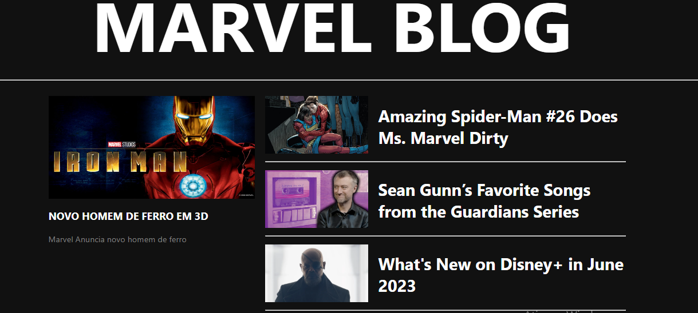

# Marvel Blog - Desenvolvendo BLOG com Angular

Projeto com consulta a api do newsapi.org desenvolvido para o Bootcamp Potencia Tech Angular Developer - Powered by Ifood da Digital Innovation One.

## Como usar

Clone o repositório na sua maquina.

Rode o comando `npm install` para baixar as dependecias do projeto.

Faca o cadastro no website do [news-api](https://newsapi.org/) para obter a `APIKEY`, não se preocupe pois e gratuito para desenvolvedores.

Abra o arquivo `article.service.ts` e adicione a `APIKEY` na variavel ` Key = ''`

Rode o comando `ng serve -o`

Pronto!

## Veja o sistema funcionando

## Links

[Digital Innovation One](https://digitalinnovation.one/)

[Deivis Rodrigues](https://www.facebook.com/deivis.rodrigues.37)
